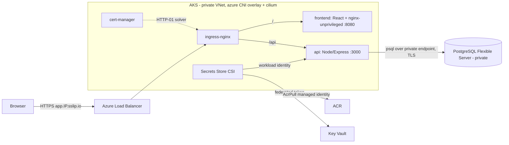

# Azure M1 — AKS three-tier app (Postgres + ingress + cert-manager + Helm)

A real three-tier application — **React** frontend, **Node/Express** API, **PostgreSQL** — running on **Azure Kubernetes Service**. Traffic enters through **ingress-nginx**; **cert-manager** issues a real **Let's Encrypt** certificate over HTTP-01 (no domain required — the public IP is wrapped in **sslip.io** magic DNS); the API reads its database password from **Key Vault** via the **Secrets Store CSI driver** using **workload identity** (no secrets in the cluster or the repo). Images are built straight to **ACR** and pulled with the kubelet's managed identity. The database is a **private, VNet-integrated PostgreSQL Flexible Server**. All infrastructure is **Terraform**; the app is packaged as a **Helm** chart.

> Built as a hands-on learning project — the largest junior→mid jump in the ladder. The whole flow (Terraform infra → images to ACR → ingress + TLS → Helm app → workload-identity DB access) was deployed for real on Azure, verified end-to-end over HTTPS, and torn down.

---

## Architecture



### Why each piece
| Concern | Choice | Why |
|---|---|---|
| Ingress | **ingress-nginx** | de-facto standard; one LB IP fronts both tiers with path routing |
| TLS without a domain | **cert-manager + Let's Encrypt + sslip.io** | `app.<ingress-ip-dashes>.sslip.io` resolves to the LB IP, so HTTP-01 works with **no DNS zone and no paid domain** |
| DB secret delivery | **Key Vault + CSI + workload identity** | the password never lives in a manifest, a `Secret` baked at build, or the repo — the pod federates an Entra token and reads KV at mount time |
| Image pull | **ACR + kubelet managed identity (AcrPull)** | no registry credentials in the cluster |
| Database | **PostgreSQL Flexible Server, private** | VNet-integrated, no public endpoint; reachable only from the AKS subnet via a private DNS zone |
| Packaging | **Helm** | one chart, value-driven, installs the three tiers + ingress + CSI wiring |

---

## What gets created

| Resource | Name pattern | Notes |
|---|---|---|
| Resource group | `rg-m1-dev-sdc-001` | everything lives here |
| VNet + subnets | `vnet-m1-dev-sdc-001` | `snet-aks` 10.20.1.0/24, `snet-pg` 10.20.2.0/24 (delegated to Flexible Server) |
| Private DNS zone | `*.private.postgres.database.azure.com` | linked to the VNet for private PG resolution |
| ACR | `acrm1devsdc001` | Basic, admin disabled; pull via managed identity |
| Key Vault | `kv-m1-dev-sdc-001` | RBAC-authorized; holds `pg-admin-password`, `pg-app-password` |
| PostgreSQL Flexible Server | `pg-m1-dev-sdc-001` | `B_Standard_B1ms`, v16, **private**, db `appdb` |
| Log Analytics | `log-m1-dev-sdc-001` | AKS monitoring (oms_agent) |
| AKS | `aks-m1-dev-sdc-001` | system pool (1× `B2s_v2`, critical addons only) + user pool (1× `B2s_v2`); azure CNI overlay + cilium; workload identity + OIDC; KV secrets provider addon |
| User-assigned identities | `id-…-aks`, `id-…-app` | cluster identity; app identity federated to the `notes-api` service account |

The cluster add-ons installed with Helm (**ingress-nginx**, **cert-manager**) and the **notes** app chart are deployed after the infrastructure (see Setup).

---

## Repository layout

```
terraform/
  versions.tf providers.tf      azurerm ~>4.6, azurerm backend
  variables.tf locals.tf        names derive from project-env-region_short-instance
  rg.tf network.tf              RG, VNet, subnets, private DNS zone + link
  acr.tf keyvault.tf            ACR Basic, Key Vault (RBAC)
  secrets.tf                    random PG passwords -> KV secrets
  postgres.tf                   private Flexible Server + appdb
  aks.tf                        AKS (system + user pools), Log Analytics, AcrPull
  app-identity.tf               app identity + federated cred for notes-api SA + KV Secrets User
  outputs.tf                    names/FQDNs consumed by the deploy commands
  example.tfvars                copy to terraform.tfvars (gitignored)
app/
  frontend/                     React + Vite + TS, multi-stage -> nginx-unprivileged :8080
  api/                          Node + Express + pg (TS), non-root, :3000, /api/healthz
charts/notes/
  Chart.yaml values.yaml
  templates/
    serviceaccount.yaml         notes-api SA with workload-identity annotations
    secretproviderclass.yaml    CSI: KV pg password -> pg-creds Secret -> PG_PASSWORD
    api-deployment.yaml         workload identity, CSI volume, readiness /api/healthz
    api-service.yaml api-hpa.yaml
    frontend-deployment.yaml frontend-service.yaml
    ingress.yaml                cluster-issuer annotation, TLS, /api -> api, / -> frontend
k8s/clusterissuer.yaml          Let's Encrypt prod ClusterIssuer (HTTP-01 via nginx)
```

---

## Prerequisites

- **Azure subscription** where **PostgreSQL Flexible Server is not offer-restricted** and the **`B2s_v2` VM size is allowed** in your region (see [Region restrictions](#region-restrictions--read-this-first) — this is what forced the choice of `swedencentral`).
- **Terraform** ≥ 1.6, **Azure CLI**, **kubectl**, **Helm** 3.
- A remote **Terraform backend** (this repo uses an Azure Storage backend via `backend.hcl`, gitignored).
- **No Docker required** — images are built server-side with `az acr build`.

---

## Region restrictions — read this first

This subscription (Visual Studio Enterprise) is **restricted in `westeurope`** in two independent ways, both of which fail an apply:

1. **PostgreSQL Flexible Server is offer-restricted** there:
   `LocationIsOfferRestricted: Subscriptions are restricted from provisioning in location 'westeurope'`.
   Check any region with:
   ```bash
   az rest --method get \
     --url "https://management.azure.com/subscriptions/<SUB>/providers/Microsoft.DBforPostgreSQL/locations/<region>/capabilities?api-version=2024-08-01" \
     --query "value[0].restricted"
   ```
   `Enabled` = blocked. (`westeurope` and `germanywestcentral` were blocked; `swedencentral`, `northeurope`, `francecentral`, `uksouth` were open.)
2. **The AKS VM size allow-list is subscription-wide and excludes the v1 B-series**: `Standard_B2s` is rejected, only the **`*_v2`** B-series (`Standard_B2s_v2`, `B4s_v2`, …) and D/E/F sizes are allowed.

Because a private PG must sit in the **same region** as the VNet/AKS, the whole stack is pinned to **`swedencentral`** (`region_short = sdc`), where both PG and `B2s_v2` are available. Change `region` / `region_short` in `terraform.tfvars` to relocate — resource names embed `region_short`, so they update automatically.

---

## Setup

> `<SUB>` = subscription id. Substitute the Terraform **outputs** where shown.

**1 — Infrastructure**
```bash
cd terraform
cp example.tfvars terraform.tfvars     # set owner, keep_until, region (default swedencentral)
terraform init -backend-config=backend.hcl
terraform apply
```

**2 — Cluster credentials**
```bash
az aks get-credentials -g $(terraform output -raw resource_group) -n $(terraform output -raw aks_name)
kubectl get nodes        # 2 Ready (system + user)
```

**3 — Build images to ACR** (no local Docker)
```bash
ACR=$(terraform output -raw acr_name)
az acr build --registry $ACR --image notes-api:0.1.0 ../app/api
az acr build --registry $ACR --image notes-frontend:0.1.0 --no-logs ../app/frontend
```
> `--no-logs` on the frontend avoids a Windows console crash on Vite's `✓` glyph during log streaming; the build still runs in ACR.

**4 — ingress-nginx + cert-manager**
```bash
helm repo add ingress-nginx https://kubernetes.github.io/ingress-nginx
helm repo add jetstack https://charts.jetstack.io
helm repo update
helm upgrade --install ingress-nginx ingress-nginx/ingress-nginx -n ingress-nginx --create-namespace \
  --set controller.service.externalTrafficPolicy=Local --set controller.replicaCount=1 --wait
helm upgrade --install cert-manager jetstack/cert-manager -n cert-manager --create-namespace \
  --set crds.enabled=true --set replicaCount=1 --wait
kubectl apply -f ../k8s/clusterissuer.yaml
```

**5 — Compute the sslip.io host from the ingress IP**
```bash
IP=$(kubectl get svc ingress-nginx-controller -n ingress-nginx -o jsonpath='{.status.loadBalancer.ingress[0].ip}')
HOST="app.${IP//./-}.sslip.io"     # e.g. app.4-165-26-110.sslip.io
echo $HOST
```

**6 — Install the app**
```bash
kubectl create namespace app
helm upgrade --install notes ./charts/notes -n app \
  --set image.repository=$(terraform output -raw acr_login_server) \
  --set postgres.host=$(terraform output -raw pg_fqdn) \
  --set postgres.user=$(terraform output -raw pg_admin_login) \
  --set ingress.host=$HOST \
  --set keyVault.name=$(terraform output -raw key_vault_name) \
  --set keyVault.tenantId=$(terraform output -raw tenant_id) \
  --set workloadIdentityClientId=$(terraform output -raw app_identity_client_id) \
  --wait
```

**7 — Verify**
```bash
kubectl get certificate -n app          # app-tls READY=True (real Let's Encrypt cert)
curl https://$HOST/api/healthz          # {"status":"ok"} over valid TLS
curl -X POST https://$HOST/api/notes -H 'content-type: application/json' -d '{"title":"hi"}'
curl https://$HOST/api/notes            # [{"id":1,"title":"hi"}]  -> DB round-trip via workload identity
kubectl get hpa -n app                  # api HPA reading CPU
```

---

## Reusability — what to change

| Change | Where |
|---|---|
| Region | `region` / `region_short` in `terraform.tfvars` (must allow PG + `B2s_v2`) |
| Project / env / instance | `terraform.tfvars` — drives every resource name |
| Node size or count | `aks.tf` (`vm_size`, `node_count` on both pools) |
| PG SKU / version / zone | `postgres.tf`, `pg_zone` var |
| App code | `app/frontend/src`, `app/api/src` |
| Image tags | `--image` on `az acr build` + `frontend.tag` / `api.tag` in `values.yaml` |
| HPA targets | `api.hpa` in `values.yaml` |
| Hostname / issuer | `--set ingress.host=…`, `k8s/clusterissuer.yaml` (swap to your own domain + DNS-01 for production) |

---

## Security notes (reviewed before publishing)

- **No secrets in the repo or the cluster manifests.** The PG password is generated by Terraform (`random_password`), stored in **Key Vault**, and delivered to the API pod at runtime by the **Secrets Store CSI driver** using **workload identity** (a federated Entra token bound to the `notes-api` service account). No password appears in a manifest, a baked image, or git.
- **Private database.** PostgreSQL Flexible Server has **no public endpoint** — it's delegated to `snet-pg` and resolved through a private DNS zone, reachable only from the AKS subnet. The client enforces TLS.
- **No registry credentials.** ACR has admin disabled; the kubelet identity has **AcrPull**, so image pulls use managed identity, not a stored secret.
- **RBAC Key Vault.** The vault is RBAC-authorized; the app identity gets only **Key Vault Secrets User** (read), nothing broader.
- **Non-root, unprivileged containers.** The API runs as a non-root user; the frontend uses `nginx-unprivileged` on port 8080. Backend secrets (`terraform.tfvars`, `backend.hcl`, `*.tfstate`) are gitignored.
- **Real, trusted TLS.** cert-manager issues a genuine Let's Encrypt certificate (verified issuer `O=Let's Encrypt`), not a self-signed cert.

---

## Best practices demonstrated

- **Workload identity over secrets** — the canonical modern pattern for pod→Azure auth; no `AZURE_CLIENT_SECRET`, no long-lived credentials.
- **Secrets at mount time, not build time** — CSI keeps the password out of the image and the manifest.
- **Private data plane** — VNet-integrated PG + private DNS, no public database surface.
- **Free, automated TLS without a domain** — sslip.io + HTTP-01 gives a real cert on an IP, ideal for ephemeral/learning clusters.
- **Helm value-driven deploys** — the same chart targets any cluster by overriding image/host/KV/identity values.
- **Managed-identity image pulls** — AcrPull instead of registry secrets.
- **HPA on the API tier** — horizontal autoscaling wired and reporting metrics.

### Build-it-from-scratch path (if you're learning)

1. **Infra first, in a region that works.** Confirm PG isn't offer-restricted and `B2s_v2` is allowed *before* applying. Get `kubectl get nodes` green.
2. **Images to ACR.** `az acr build` both tiers; confirm tags exist. No Docker needed.
3. **Ingress + a plain HTTP app.** Install ingress-nginx, expose the frontend, hit the LB IP over HTTP before touching TLS.
4. **TLS.** Install cert-manager, apply the ClusterIssuer, compute the sslip.io host, add the ingress TLS block; watch the `Certificate` go `Ready`.
5. **Database via workload identity.** Federate the app identity to the `notes-api` SA, grant Key Vault Secrets User, wire the SecretProviderClass, and have the API read `PG_PASSWORD` from the mounted `Secret`.
6. **Autoscale + verify.** Add the HPA, then prove the full path: HTTPS health, a POST/GET that round-trips Postgres, and a valid Let's Encrypt cert.

> Gotchas worth internalizing: this subscription blocks **PG in `westeurope`** *and* the **v1 B-series everywhere** — surface those with the capabilities REST call and the AKS error's "available VM sizes" list before guessing. The API runs `CREATE TABLE` on startup, so it connects as the PG admin (`pgadmin`) using `pg-admin-password`; a least-privilege app role would need a bootstrap step since the private DB isn't reachable from a laptop. `az acr build` on Windows can crash while streaming Vite's `✓` output — use `--no-logs`.

---

## Real-world scenarios where this pattern applies

- **Standard SaaS topology** — frontend + API + managed Postgres behind an ingress is the baseline shape of most web products.
- **Secretless pod→cloud auth** — workload identity + CSI is exactly how you keep DB/queue/storage credentials out of clusters in production.
- **Private-database compliance** — VNet-integrated PG with no public endpoint is a common security/compliance requirement.
- **Ephemeral/preview environments** — sslip.io + Let's Encrypt gives every short-lived cluster a real HTTPS URL with no DNS plumbing.
- **Cost-controlled learning/staging** — apply, demo, `terraform destroy`; the whole stack rebuilds from code in ~20 minutes.

---

## Issues we hit (and how we fixed them)

Real problems from building this for real — the root-cause/fix is the useful part. (The two region restrictions that forced `swedencentral` are covered above in [Region restrictions](#region-restrictions--read-this-first).)

### `terraform apply` failed on both Postgres and AKS in West Europe
**Symptom:** Apply created ~18 resources then failed: Postgres with `LocationIsOfferRestricted`, AKS with "VM size `Standard_B2s` is not allowed in your subscription in location 'westeurope'".
**Cause:** Two independent subscription restrictions in `westeurope` — PG Flexible Server is **offer-restricted**, and the VM allow-list excludes the **v1 B-series** (only `*_v2` allowed).
**Fix:** Moved the whole stack to **`swedencentral`** (where both are available) and switched node pools to **`Standard_B2s_v2`**. Because a private, VNet-integrated PG must live in the same region as the cluster, the entire stack relocates together. See the [Region restrictions](#region-restrictions--read-this-first) section for the exact capability checks.

### `az acr build` of the frontend crashed the terminal
**Symptom:** The frontend image build aborted with `'charmap' codec can't encode character '\u2713'`.
**Cause:** The Azure CLI streams the remote build log, and Windows' console encoding can't render Vite's `✓` glyph — the **client** crashes even though the **server-side build succeeds**.
**Fix:** Add `--no-logs` to `az acr build` for the frontend. The image still builds and pushes in ACR.

### API pod couldn't authenticate to Postgres
**Symptom:** The API never became ready; it couldn't connect to the database.
**Cause:** The Helm chart's CSI `SecretProviderClass` mounted `pg-app-password`, but the app connects as the `pgadmin` server admin (and runs `CREATE TABLE` on startup, which needs that role). Admin user + app-password = auth failure.
**Fix:** Pointed the CSI mount at `pg-admin-password` (keyed to `PG_PASSWORD`) so the user and password match. (A least-privilege app role would need a bootstrap step, since the private DB isn't reachable from a laptop.)

---

## Cost

```bash
helm uninstall notes -n app
terraform destroy        # tears down AKS, PG, ACR, KV, VNet
```

---

## License

MIT — see [LICENSE](LICENSE).
